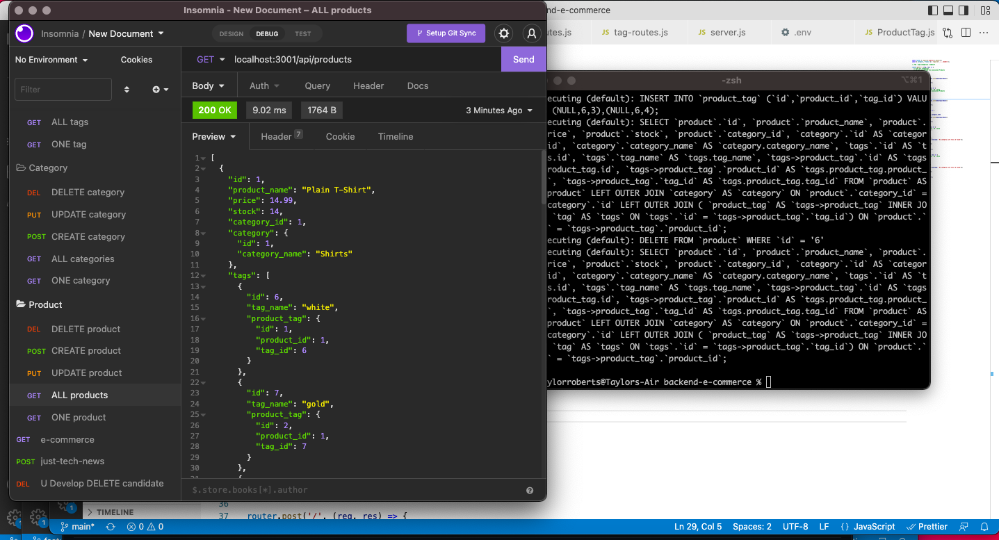

# Backend E-Commerce

## Description

This is a backend project that allows users to use the CRUD method to modify shop inventory including tags, products, and categories. This project also allows for associations, for example categories have products and tags associated with it so that the user understands exactly which product(s) is under each category.

## Installation 

For this project the user will have to clone the repository into their file of choice. Once the user has cloned the repo it is important that they creat their own .env file and enter their mySQL credentials in order for this application to properly run. After that the user will open mySQL while in the root directory, type in 'source db/schema.sql' in order to create the databse. The user can enter 'show databases' in the comand line to ensure that ecommerce_db was successfully created. After exiting mySQL, the user should then run the command 'npm run seed' into their terminal in order to seed that tables with the data in the seeds file.

## Usage 

Once the installation process is complete, the user can then enter 'npm start' in their command line to start the server. Once the server is running the user may use Insomnia to test the routes. They can also change, create, delete, and show the different categories/tags/products of inventory to suite their e-commerce needs.

## Demo 

Please click [here](https://drive.google.com/file/d/1EAnO57kwQ4WuDu_hRyE3_l5OxPyuFTVy/view) to watch a demonstration of this project!